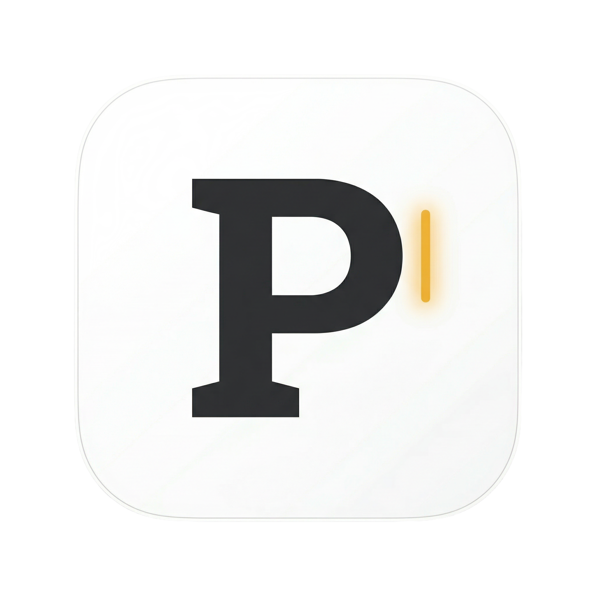

  

<h1 align="center">PIX Markdown Editor</h1>

  <strong>一款极简、优雅的跨平台专业 Markdown 桌面化创作终端。</strong> 
  <em>A minimalist, elegant, cross-platform professional Markdown desktop editor.</em>

	<a href="#-简体中文">🇨🇳 简体中文</a> | <a href="#-english">🌐 English</a> 

---

## 🇨🇳 简体中文

### ✨ 特性 (Features)

PIX 致力于剥离一切不必要的干扰，为您提供**沉浸式纸质化单栏写作体验**，并专门针对中文沉浸式长文工作流进行了底层优化。

- 🦋 **全域极简视觉 UI**：纯白底色、无边界流出排版，享受纯粹打字反馈。
- 🇨🇳 **原生级中文排版引擎**：底层强制智能匹配 `苹方` 与 `微软雅黑`，内置 1.8 科学行高，打造顶级中文阅读节奏。
- ⚡ **无缝双向渲染热切**：只需按下 `Ctrl + P` (Mac环境为 `Cmd + P`)，源码形态与所见即所得形态即刻平滑切换。
- 📚 **动态大纲提取 (Outline/TOC)**：一键呼出侧边目录 Drawer，实施锚点追踪与长文定位。
- 💾 **自动防抖保存流**：告别疯狂的 `Ctrl+S`。任何时候打字停顿 **3 秒**，引擎隐式触发底层写入以保护您的灵感结晶。
- 📥 **即拿即丢 (Drop & Edit)**：从桌面随便拖拽任何 `.md` 文本扔进窗口，瞬时覆盖开启编辑。

### 📦 下载与安装 (Download)

请点击右侧的 **[Releases]** 面板，直接下载最新版本的绿色免安装版 / Windows 安装引导程序使用。

### ⌨️ 快捷工作流 (Hotkeys)

- **`Ctrl + O`** ：打开本地文件。
- **`Ctrl + N`** ：清空视图、新建创作。
- **`Ctrl + S`** ：强制覆盖保存到原始路径。
- **`Ctrl + P`** ：源码/预览 视图热切交叠。

---

## 🌐 English

### ✨ Features

PIX strips away unnecessary distractions, offering an **immersive single-column UI** tailored for distraction-free writing workflows.

- 🦋 **Minimalist UI**：Pure white canvas with borderless layouts for unhindered typing feedback.
- 🇨🇳 **Native CJK Optimization**：Smart fallback to `PingFang` and `Microsoft YaHei` with a perfectly calibrated 1.8 line-height for CJK rhythm.
- ⚡ **Seamless Mode Switching**：Hit `Ctrl + P` (`Cmd + P` on macOS) to instantly jump between Source Code and WYSIWYG rendering.
- 📚 **Dynamic Outline (TOC)**：Summon the Outline Sidebar to effortlessly navigate through massive documents using real-time anchor tracking.
- 💾 **Silent Auto-Save**：Forget `Ctrl+S`. PIX acts like a daemon and implicitly flushes your work to disk after **3 seconds** of typing silence.
- 📥 **Drop & Edit**：Drag any `.md` or `.txt` file straight from your desktop into the window and start writing immediately.

### 📦 Download & Installation

Visit the **[Releases]** panel on the right to download the latest Windows installer or portable executable.

### ⌨️ Productivity Hotkeys

- **`Ctrl + O`** : Open a local file.
- **`Ctrl + N`** : Clear view & create new document.
- **`Ctrl + S`** : Force save modifications to disk.
- **`Ctrl + P`** : Toggle Source/Preview modes.

---

  Powered by Flutter Desktop Engine.

